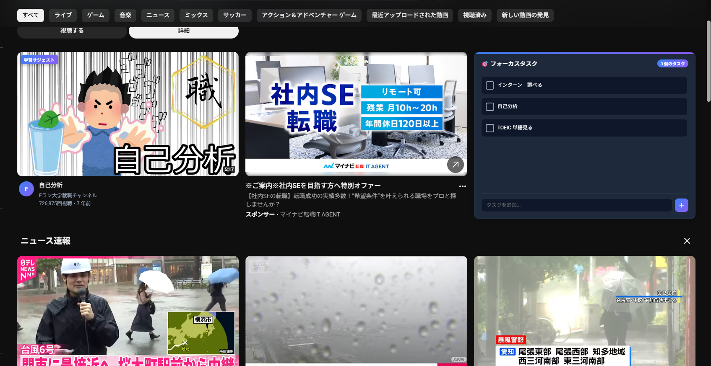

# 🎯 YouTube Task-Inject

### YouTubeの利便性はそのままに、おすすめフィードをハックして無意識のダラダラ見を学習に誘導するChrome拡張機能

---

## 💡 開発のきっかけ（つくった理由）
大学生の皆さん、あるいはPCで作業をする皆さん。**「課題やテスト勉強をしなきゃいけないのに、BGMを探しにYouTubeを開いたら、気づけばおすすめ動画を2時間ダラダラ見ていた…」**なんて経験はありませんか？（僕はめちゃくちゃあります笑）

世の中にはアクセス制限やサイトブロッカーなどの「ガチガチの制限ツール」もありますが、あれってめちゃくちゃストレスが溜まって、結局すぐにアンインストールしちゃいませんか？
YouTubeはプログラミングの解説動画を見たり、勉強用BGMを流したりするのには最高のツールなので、完全にブロックしたくはありません。

そこで、**「YouTubeの本来の機能は一切制限せず、ホーム画面やサイドバーのおすすめフィードだけをハックして、自分のタスクや学習動画を『異物』として自然に割り込ませる仕組み」**を作れば、ストレスなく自然に行動を軌道修正できるんじゃないか？と思い、この拡張機能を開発しました！

---

## 🌟 主な機能

### ① タスクプロンプト・インジェクション (タスク未設定時)
* タスクが1つも登録されていない場合、YouTubeのホーム画面や動画再生画面のサイドバーに、一定の割合（9個に1個）で**「タスクがありません。まずはタスクの洗い出しをしましょう」**というパネルをインジェクトします。
* パネルからその場ですぐにタスクを追加できます。

### ② ダイナミック・タスクプレッシャー (タスク設定時)
* 登録されている未完了タスクの「数」に応じて、おすすめフィードをタスクパネルで上書きする頻度が動的にアップします。
  * **タスクが1〜2個**: 9個に1個の割合
  * **タスクが3〜5個**: 6個に1個の割合
  * **タスクが6個以上**: **3個に1個**の割合（画面がタスクと学習動画だらけになり、視覚的なプレッシャーを与えます）
* パネル上のチェックボックスをクリックしてタスクを消化すると、**元の動画サムネイルがスッと復活**します。この「ご褒美感」がダラダラ見を防ぐモチベーションになります。

### ③ Shadow Search（コンテキスト連動型・動画サジェスト）
* 登録されたタスクの文字列（例：「基本情報技術者試験 アルゴリズム」）をキーワードとして、**バックグラウンドで自動的にYouTube検索を実行**します。
* 検索結果から取得したチュートリアルや解説動画を、YouTubeのおすすめフィードや関連動画サイドバーの中に「**学習サジェスト**」バッジ付きでインジェクトします。
* これにより、娯楽動画だらけのフィードの中に自然と学習動画が紛れ込み、検索する手間なくスムーズに勉強モードに移行できます。

---

### 実行画面



## 🛠️ 技術スタック
* **コア**: HTML5 / CSS3 (Vanilla CSS) / JavaScript (Vanilla JS)
* **拡張機能仕様**: Chrome Extensions Manifest V3
* **データ保持**: `chrome.storage.local` (タスクの永続化と、ポップアップ・コンテンツスクリプト間のリアルタイム同期)
* **通信・処理**: Service Worker (Background Script) による非同期データ取得

---

## 🚀 大学生なりの「技術的こだわり」と工夫したポイント

### 1. APIキー不要＆無制限の「Shadow Search」の実現
通常、YouTubeの検索結果をプログラムで取得するには「YouTube Data API」を使いますが、これには開発者登録が必要な上に、**「1日の無料検索回数が100回程度」という厳しい制限（クォータ制限）**があります。個人開発のポートフォリオとして配布するにも、APIキーの管理は面倒です。
そこで、バックグラウンド（Service Worker）でYouTubeの検索結果ページをHTTP fetchし、HTMLソースに埋め込まれているグローバルJSONデータ（`ytInitialData`）を正規表現で正確に引っこ抜く**独自のスクレイピングパーサー**を自作しました。
これにより、**APIキー不要・完全無料・検索クォータ制限なし**で、動画タイトル、サムネイルURL、再生時間、投稿時間、再生回数などをJSONデータとして爆速で取得することに成功しました！

### 2. YouTubeのSPA（Single Page Application）遷移への完全追従
YouTubeはページを遷移する際、ブラウザ全体のリロードを行わず、AjaxによるDOM書き換え（SPA）を行っています。
そのため、通常のコンテンツスクリプトのように「ページ読み込み時だけ実行する」設計だと、動画をクリックした瞬間にインジェクションが動かなくなってしまいます。
これに対応するため、YouTube独自の遷移イベント `yt-navigate-finish` を検知し、ホーム画面（`/`）や動画再生画面（`/watch`）など、対象ページに入った時だけ動的にDOM監視（MutationObserver）を再起動・リセットするライフサイクル設計を行いました。

### 3. DOM監視の無限ループ対策と軽量化
YouTubeはスクロールするたびに新しい動画が次々と動的にロードされます。これを `MutationObserver` で検知してインジェクションを行いますが、**「拡張機能がDOMを追加したこと」自体をObserverが検知してしまい、無限ループ（再レンダリングの嵐）が発生するバグ**に直面しました。
これに対し、以下の2つのアプローチで徹底的に対策し、PCに負荷をかけない極めて軽量な動作を実現しました。
* DOM操作の実行前後で `isManipulatingDOM` フラグを立て、DOM操作中は一時的にObserverのコールバックを完全にバイパス（無視）する。
* Observerの検知対象から、拡張機能が追加したラッパー要素（`task-inject-wrapper` 等）をクラス名で除外する。

### 4. グリッドの「縦並び固定」を防ぐランダム散布アルゴリズム
「9個に1個」のように単純な割り算でインジェクションを行うと、YouTubeの画面カラム数（4列グリッドなど）と干渉して、**「常に一番右端の列だけにタスクパネルが縦一列に並んでしまう」**という見た目の偏りが発生してしまいました。
これを解決するため、未処理の動画要素を `ratio`（9個、6個、3個など）のバッファプールに一度溜め、**そのブロックの中で毎回ランダムなインデックスを1つ選んでインジェクトするアルゴリズム**を実装しました。これにより、出現確率はきっちり維持したまま、グリッド上にバランスよくランダムに散らばるようになり、見た目の自然さが格段に向上しました。

### 5. サイドバーに完全に溶け込む「レスポンシブ・コンパクトUI」
動画を見ているときの右側の関連動画エリア（サイドバー）は、ホーム画面と違って横長のレイアウト（サムネイルが左、テキストが右）になっています。
ここにホームと同じ縦長カードを無理やり入れるとデザインが崩れてしまうため、親要素が `ytd-compact-video-renderer` の場合は自動的に `.ti-compact` クラスを付与し、YouTubeのサイドバーのサイズ・マージン・配置と寸分違わない**「横並びコンパクトスタイル」**に動的にレンダリングを切り替えるようにCSSとJSを設計しました。

---

## 📂 ディレクトリ構成
```text
youtube-extention/
├── manifest.json      # 拡張機能の設定ファイル (Manifest V3)
├── background.js      # バックグラウンド処理（YouTube検索プロキシ & Scraping）
├── content.js         # YouTubeのDOM監視、インジェクション適用、SPA制御
├── content.css        # インジェクトするUIのスタイル（通常版・コンパクト版）
├── popup.html         # アイコンクリック時のタスク管理ポップアップ
├── popup.css          # ポップアップのスタイリッシュなダークテーマCSS
├── popup.js           # ポップアップのタスク追加・削除・完了トグル処理
└── README.md          # このファイル
```

---

## ⚙️ インストール方法（開発者モードでの読み込み）

Node.jsのビルド環境がなくても、ダウンロードしてそのままChromeに読み込ませるだけで動きます！

1. このリポジトリをご自身のローカル環境にクローン、またはZIPでダウンロードして解凍します。
2. Google Chromeを開き、アドレスバーに `chrome://extensions/` と入力して拡張機能管理ページを開きます。
3. 画面右上にある **「デベロッパー モード」** のトグルスイッチを **ON** にします。
4. 画面左上に表示される **「パッケージ化されていない拡張機能を読み込む」** ボタンをクリックします。
5. フォルダ選択ダイアログが表示されるので、解凍した `youtube-extention` フォルダを選択します。
6. インストール完了！YouTubeを開いてさっそく試してみてください！
